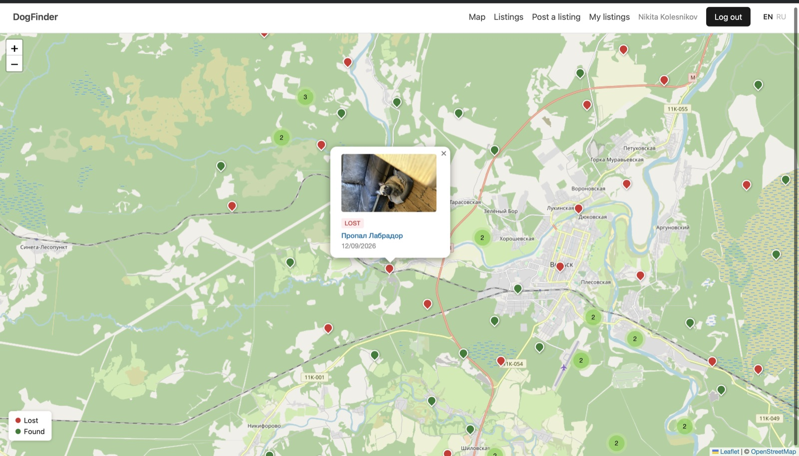
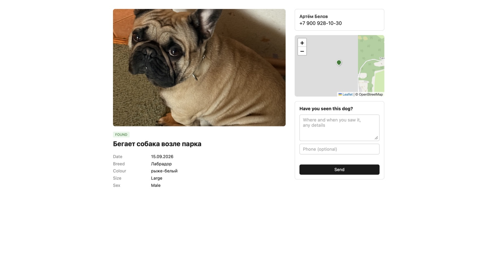
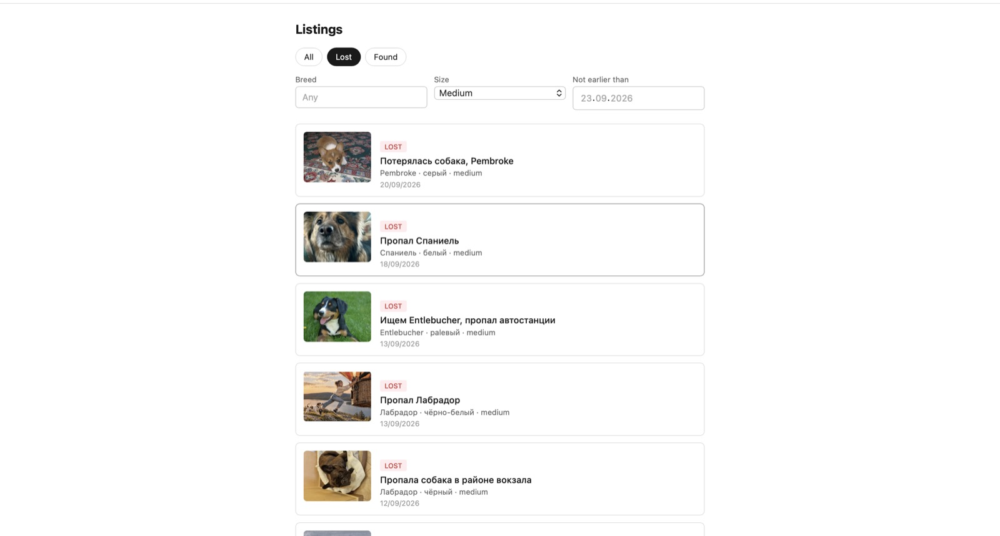

# DogFinder


**English** | [Русский](README.ru.md)

**Live demo:** https://dogfinder.nkolesnikov.dev

A service for finding lost dogs. An owner posts a listing about a lost dog, someone who found a dog posts a listing about the find, and the system matches the two by photo and location and notifies both people.

What sets it apart from a regular classifieds board is that the search runs on visual similarity of photos rather than on text. A description like "ginger, medium-sized, wearing a collar" is subjective and hard to search; a photo is not.

The interface is available in English and Russian.

## How it works

1. A user uploads a photo and marks where the dog was lost or found.
2. An object detector locates the dog in the photo and crops it, discarding the background.
3. A neural network turns the crop into a feature vector (an embedding).
4. When a new listing appears, the system looks for candidates among listings of the opposite type and ranks them by a combination of visual similarity, distance, and proximity in time.
5. If a match scores above a threshold, both owners receive an email.

Step 2 is not cosmetic. Without the crop, the model encodes the whole scene, and photos of different dogs against a similar background end up closer to each other than two photos of the same dog in different surroundings.

## Features

- [x] Registration and authentication
- [x] Lost and found listings
- [x] Multiple photos per listing with thumbnails
- [x] Radius search from a point, address geocoding
- [x] Interactive map with marker clustering
- [x] Listings feed with filters
- [x] Responses to listings and response management
- [x] Automatic photo-based matching
- [x] Email notifications for responses and matches
- [x] English and Russian interface, emails in the recipient's language
- [x] Demo data, tests, CI, production image
- [x] Public deployment with HTTPS







## Tech stack

| Layer | Choice | Why |
|---|---|---|
| API | FastAPI, Python 3.12 | async, auto-generated docs |
| ORM | SQLAlchemy 2.0 (async), asyncpg | |
| Database | PostgreSQL 16 | |
| Geodata | PostGIS | radius search in the database rather than in Python |
| Vector search | pgvector | embeddings live in the same database as the geodata |
| Migrations | Alembic | |
| File storage | MinIO (S3-compatible) | uploads bypass the API via presigned URLs |
| ML | CLIP ViT-B/32, YOLOv8n | pretrained models, no fine-tuning |
| Email | aiosmtplib | sending without blocking the event loop |
| Localization | Babel, gettext | |
| Frontend | Jinja2, Leaflet, vanilla JavaScript | |
| Tests | pytest, pytest-asyncio, httpx | |
| CI | GitHub Actions | lint and tests on every push |
| Infrastructure | Docker Compose, Caddy | HTTPS with automatic certificates |

### Why pgvector instead of a dedicated vector database

Matching is always combined: visual similarity plus distance plus proximity in time. If vectors lived in a separate store and geodata in Postgres, the two result sets would have to be merged in application code. That means either an incomplete candidate set or a slow query. A single `SELECT` with filters and ordering by `<=>` solves the whole problem.

### Why the models are not fine-tuned

CLIP and YOLO are used as pretrained. Fine-tuning for this task would require a labeled dataset of "the same dog in different conditions" pairs, and no such dataset of sufficient size is publicly available. Off-the-shelf models are good enough for the system to work, as the measurements below show.

## Architecture

In production every component runs in a container, and only Caddy is exposed to the internet:

```
                         Internet
                            │
                       Caddy (HTTPS)
                    ┌───────┴────────┐
    dogfinder.nkolesnikov.dev   s3.nkolesnikov.dev
                    │                │
                 FastAPI ──────────► MinIO
                    │
      BackgroundTasks: thumbnails, embeddings, matching, email
                    │
        PostgreSQL + PostGIS + pgvector
```

CLIP and YOLO are loaded into memory once, when the application starts. The `ML_LAZY_LOAD` variable defers loading until first use. That is only needed during development, when `--reload` restarts the process after every edit. In production the models load at startup: a loading failure surfaces immediately at deploy time, and memory usage is predictable from the first minute.

## Roadmap

| Block | Scope | Status |
|---|---|---|
| 0 | Project skeleton, Docker, configuration, migrations | done |
| 1 | Users, listings, responses, authentication | done |
| 2 | Photo uploads to object storage | done |
| 3 | PostGIS, radius search, geocoding | done |
| 4 | Map, pages, forms | done |
| 5 | Detection, embeddings, vector search | done |
| 6 | Email notifications | done |
| 7 | Feed with filters, localization | done |
| 8 | Demo data, tests, CI, production image, deployment | done |

A points system for confirmed finds was part of the original plan but was dropped. Gamification is hard to justify in a service where people look for lost pets: participants are motivated enough without points. The mechanic also adds no technical depth — it amounts to an events table and an aggregate over it.

## Requirements

- Docker and Docker Compose
- [uv](https://docs.astral.sh/uv/) (Python package manager)

There is no need to install Python separately — uv downloads the right version itself.

## Quick start

```bash
git clone https://github.com/nikitojik/Dogfinder.git dogfinder
cd dogfinder

cp .env.example .env
uv sync

docker compose up -d
uv run alembic upgrade head
uv run pybabel compile -d app/locales
uv run uvicorn app.main:app --reload
```

The values in `.env.example` work for a local run as they are. To send email, fill in `SMTP_USER` and `SMTP_PASSWORD`; without them the application still works, but notifications are not delivered. They can be disabled entirely with `NOTIFICATIONS_ENABLED=false`.

Model weights are downloaded on first run: about 600 MB for CLIP and 6 MB for YOLO.

Local addresses:

| Address | What it is |
|---|---|
| http://localhost:8000 | application |
| http://localhost:8000/docs | API documentation |
| http://localhost:8000/health | health check |
| http://localhost:9001 | MinIO console (`minioadmin` / `minioadmin`) |

## Health check

```bash
curl http://localhost:8000/health
```

Expected response:

```json
{"status": "ok", "postgis": "3.4.x", "pgvector": "0.7.x"}
```

A value of `not installed` means migrations have not been applied.

## Demo data

```bash
NOTIFICATIONS_ENABLED=false uv run python -m app.scripts.seed
```

Creates eight demo users and about 230 listings around a configurable center point:

- 200 listings with photos from the [Dog CEO API](https://dog.ceo/dog-api/), which is built on the Stanford Dogs Dataset. The breed is extracted from the image URL
- 15 lost-and-found pairs from my own photos in `experiments/data`, two photos of the same dog taken in different conditions. These pairs demonstrate matching

The live demo is seeded around Velsk, a small town in northern Russia.

The script refuses to run while notifications are enabled: otherwise every new listing would trigger emails to the owners of the matches it finds.

Demo users get addresses on the `dogfinder.demo` domain. Mail to that domain is never sent — on a public instance, every photo upload would otherwise produce a batch of undeliverable emails. All demo accounts use the password `demopassword`.

## Development

### Managing the environment

```bash
docker compose stop     # stop containers
docker compose start    # start them again
docker compose down     # remove containers, data is kept
docker compose down -v  # remove containers together with data
```

### Migrations

```bash
uv run alembic revision --autogenerate -m "description"
uv run alembic upgrade head
uv run alembic downgrade -1
uv run alembic current
```

Autogeneration only sees models imported in `app/models/__init__.py`. If a migration comes out empty, an import is most likely missing.

Migrations with enum types need manual editing: Alembic creates the types but does not drop them in `downgrade`. Spatial columns have the opposite problem — GeoAlchemy2 creates the GIST index on its own, so the generated `create_index` has to be removed from the migration.

### Translations

After adding new strings to the interface:

```bash
uv run pybabel extract -F babel.cfg -o app/locales/messages.pot .
uv run pybabel update -i app/locales/messages.pot -d app/locales
uv run pybabel compile -d app/locales
```

`update` keeps existing translations and adds new strings with an empty `msgstr`. Untranslated entries can be found by searching for `msgstr ""` in `app/locales/ru/LC_MESSAGES/messages.po`.

Compiled `.mo` files are not stored in the repository — they are built when the Docker image is built.

### Recomputing embeddings

```bash
uv run python -m app.scripts.backfill_embeddings
```

Processes photos that do not have a vector yet: creates a thumbnail, runs the detector, computes the embedding.

### Tests

The tests need a separate `dogfinder_test` database, created once:

```bash
docker compose exec db psql -U dogfinder -d postgres -c "CREATE DATABASE dogfinder_test;"
```

Then:

```bash
uv run pytest -v
```

The test schema is built by running the Alembic migrations rather than by calling `create_all` on the metadata. That costs a couple of seconds, but the tests run against the same schema as production and also verify that the migrations apply cleanly. There is a practical reason as well: `create_all` generates invalid DDL for GeoAlchemy2 spatial columns.

The application session is swapped out through `dependency_overrides`, and requests go through `httpx.ASGITransport` without starting a server. Tables are cleared after every test.

What is covered:

- **authentication** — registration, login, invalid tokens, no password hash in responses
- **authorization** — another user's listing cannot be modified
- **listings** — partial updates leave other fields intact, deletion archives the listing, filters and pagination
- **geo search** — radius cutoff, ordering by distance, distance reported in meters

The last test guards against a silent error: if `geography` were replaced with `geometry`, distances would come back in degrees, and the range check would fail.

### Linter

```bash
uv run ruff check --fix .
uv run ruff format .
```

It runs automatically before each commit through pre-commit:

```bash
uv run pre-commit install
```

### CI

GitHub Actions runs two independent jobs on every push to `main` and on every pull request.

**Lint** runs the same pre-commit hooks as a local commit. Results in CI and locally match because the same tool versions are used.

**Tests** build the Postgres image from `docker/postgres/Dockerfile`, since no public image ships both PostGIS and pgvector. This also verifies that the Dockerfile builds.

Database readiness is checked with `pg_isready -h 127.0.0.1` rather than plain `pg_isready`. On first start, the official image runs a temporary server for initialization that listens only on a unix socket. Without the flag, the check reports readiness during initialization, and the tests fail when the server restarts.

## Deployment

Day-to-day server operations — updating code, logs, backups, troubleshooting — are covered in [SERVER.md](SERVER.md).

### Application image

```bash
docker build -t dogfinder-app .
```

The build has three stages: a shared base with system libraries, a build stage with uv and its caches, and a final stage containing only the result. The resulting image is about 2 GB.

**PyTorch without CUDA.** On Linux, the standard PyTorch build pulls in libraries for NVIDIA GPUs — several gigabytes that are useless on a server without a GPU. In `pyproject.toml`, torch and torchvision are taken from PyTorch's CPU index on Linux. On macOS the platform marker does not match, and the regular build with MPS support is used.

**Weights baked into the image.** CLIP and YOLO are downloaded at build time, and `HF_HUB_OFFLINE=1` is set at runtime. The container starts without touching the network and does not depend on Hugging Face being available. If the weights were ever missing, the application would fail at startup instead of silently downloading 600 MB.

**Unprivileged user.** The application runs as a non-root user inside the container.

On startup the container applies migrations and runs uvicorn with a single worker. A second worker would double the memory spent on the models, and email throttling and the geocoder rate limit are designed for a single process.

The image is built for the architecture of the machine that builds it. An image built on Apple Silicon will not run on an x86 server, so the server builds it from source.

### Two storage addresses

The application and the browser reach MinIO at different addresses. The application talks to it inside the Docker network at `http://minio:9000`; the browser uses the public `https://s3.nkolesnikov.dev`.

This matters for presigned URLs: the host is part of the signature, so a URL signed for the internal address will not work at the public one. The code therefore uses two S3 clients. The internal one handles files, and the second one only signs URLs. Signing is computed locally without any network calls, so the second client only needs to know the public address from `S3_PUBLIC_ENDPOINT`.

### Production configuration

`docker-compose.prod.yml` describes the whole system: the application, the database, MinIO, and Caddy.

- only Caddy's ports, 80 and 443, are exposed
- the database is reachable only inside the Docker network
- the MinIO console is bound to `127.0.0.1` and reachable only through an SSH tunnel
- the application starts only after the database and storage pass their health checks and the bucket has been created
- Caddy obtains and renews Let's Encrypt certificates on its own; they are kept in a dedicated volume so that recreating the container does not burn through the issuance rate limit
- the project has its own name, `dogfinder-prod`, so its volumes never collide with the development ones

MinIO images are pulled from `quay.io`. In September 2026 MinIO removed `minio/minio` and `minio/mc` from Docker Hub after archiving its community edition. Docker Hub answers such requests with "pull access denied", which looks like an authentication problem even though the repository simply no longer exists.

Settings come from `.env.prod`; the template is `.env.prod.example`. Passwords are best generated with `openssl rand -hex 24`: base64 output can contain `/`, which breaks the database connection string.

Check the configuration without starting anything:

```bash
docker compose -f docker-compose.prod.yml --env-file .env.prod config
```

Start on the server:

```bash
docker compose -f docker-compose.prod.yml --env-file .env.prod up -d --build
```

Before the first start, the DNS records for both subdomains must point to the server. Otherwise Caddy cannot obtain a certificate, and after several failed attempts Let's Encrypt temporarily blocks issuance for the domain.

## Project structure

```
app/
├── main.py           entry point, routers, lifespan
├── config.py         settings from environment variables
├── db.py             SQLAlchemy engine and sessions
├── models/           table models
├── schemas/          request and response schemas (Pydantic)
├── api/              HTTP and page handlers
├── services/         matching, geocoding, storage, email, background tasks
├── core/             security, localization, templating
├── ml/               detection and embeddings
├── scripts/          demo data, embedding backfill
├── locales/          translation catalogs
├── static/           CSS and JavaScript
└── templates/        page and email templates

tests/                API tests
experiments/          matching prototypes and quality measurements
migrations/           Alembic migrations
docker/               Postgres image, application entrypoint
.github/workflows/    CI
Dockerfile            application image
docker-compose.yml         development environment
docker-compose.prod.yml    production
Caddyfile             routing and HTTPS
SERVER.md             server operations guide
```

## How matching works

### Combined score

The final score has three parts:

```
score = 0.6 × visual similarity
      + 0.2 × distance proximity
      + 0.2 × time proximity
```

The distance and time components decay exponentially: `exp(-x / scale)`, with a scale of 20 km and 30 days. Linear decay would behave worse: for finding a dog, the difference between one and two kilometers matters far more than the difference between fifty and fifty-one.

Candidates are drawn only from listings of the opposite type: found dogs for a lost listing, and vice versa.

### Different thresholds for different channels

The listing page shows candidates with visual similarity above **0.55**. The person came to look, and scanning five candidates costs them little.

An email is sent when the combined score exceeds **0.70**. A notification arrives uninvited, and a false positive is more annoying than a missed match.

## Notifications

Emails are sent in two cases: someone responded to a listing, or the system found a similar listing.

A match produces two emails — one to each owner. Without that there would be a gap: a lost-dog listing posted a month ago would never hear about a fresh find, because matching runs only for the new listing.

### Deduplication

The `notifications` table records every send with a unique constraint on the triple "type, listing, subject of the notification". The record is reserved **before** the email is sent, and an attempt to insert a duplicate fails on the constraint.

The reverse order would allow a race: two background tasks check "not sent yet" at the same moment, and both send. A unique index in the database is the only reliable guard.

### Throttling

No more than 10 emails per user per day. Failed attempts do not count — only records with `sent = true`.

## Localization

The interface is available in English and Russian. The language is resolved in order: the `lang` cookie, then the `Accept-Language` header, then the default. An explicit user choice takes precedence over browser settings.

Source strings in the code are written in English and serve as translation keys. This lets the application work even without compiled catalogs: when a translation is missing, gettext returns the source string, which is already in the default language.

### Strings in JavaScript

Babel does not parse JavaScript, so labels used by the scripts are collected into a `window.I18N` object, built in the base template with the same `_()`. The scripts read their text from there.

The alternative would be a separate JSON catalog for the frontend, but then translations would have to be maintained in two places.

### Email language

A background task has no access to the browser's cookie — the HTTP request is long gone by then. So the chosen language is stored in the user profile: the `locale` column is set at registration and updated when the user switches languages. Emails are rendered in the recipient's language, subject line included.

## Measurements

### Geo search performance

100,000 listings with random coordinates, PostgreSQL 16, 5 km radius:

| Query | Index | Plan | Time |
|---|---|---|---|
| `ST_DWithin` | GIST | Index Scan | 6.8 ms |
| `ST_DWithin` | none | Parallel Seq Scan | 99.5 ms |
| `ST_Distance < 5000` | GIST | Parallel Seq Scan | 100.6 ms |

The third row shows that having an index guarantees nothing by itself. `ST_Distance` is computed for every row in the table, and the planner cannot use the spatial index. `ST_DWithin` first selects candidates by bounding boxes through the index and applies the exact geodesic formula only to them — visible in the plan as the `Rows Removed by Filter` line.

The column is declared as `geography`, not `geometry`. With `geometry` and SRID 4326, distances are computed in degrees, and a "5 km radius" query would return a meaningless result — without any error at all.

### Photo matching quality

A set of 15 dogs, two photos each, taken in different conditions:

| Approach | Recall@1 | Recall@5 | Recall@10 |
|---|---|---|---|
| CLIP ViT-B/32, full photo | 0.567 | 0.767 | 0.833 |
| CLIP ViT-B/32, YOLO crop | 0.700 | 0.833 | 0.933 |

Detecting the dog before computing the embedding removes background information from the vector. Without it, the model encodes the whole scene, and photos of different dogs in similar surroundings end up closer together than two photos of the same dog at home and outdoors.

Recall@k is the target metric because the system does not make the final call — it shows a list of candidates, and a person decides. An owner does not care whether their dog is ranked first or seventh; what matters is that it appears in the list they look through.

### Dog detection rate

| Sample | Photos | Dog detected |
|---|---|---|
| Own dataset | 30 | 24 (80%) |
| Demo data: Dog CEO and own dataset | 230 | 192 (83%) |

The result held on a sample eight times larger, so it is a stable property of YOLOv8n on real-world dog photos rather than a small-sample fluke. The remaining photos are processed whole: a model trained on COCO struggles with close-ups of a dog's face and with shots where the dog occupies a small part of the frame.

### Interpreting cosine similarity

On the test set, two photos of the same dog had a similarity of 0.604, while clearly different images never exceeded 0.31.

The 0.55 cutoff sits inside that gap. Absolute cosine values for CLIP embeddings should not be read as "percent similarity" — what matters is the relative gap between matches and non-matches.

### Why the vectors have no index

An HNSW index speeds up nearest-neighbor search at the cost of approximation and takes a while to build. With a few hundred vectors, a full scan is faster: Postgres reads the table in milliseconds, and an index would only add overhead.

An index starts paying off at tens of thousands of rows — unlike the GIST index on geodata, which is needed from the start because geometric operations are more expensive than a dot product.

## Known limitations

**Similar breeds.** Dogs of common breeds look very much alike. For a golden retriever, the system returns dozens of candidates with high similarity. Radius and date filters help partly, but the problem cannot be fully solved without individual features — tattoos, microchips, distinctive markings.

**Photo quality.** The model is sensitive to angle and lighting. A shot from behind and a close-up of the face of the same dog can end up further apart than photos of two different dogs taken from the same angle.

**Coordinate precision.** Listing coordinates are published as is. For found dogs this is necessary: the owner relies on the pin, and an error of two hundred meters can cost the outcome. For lost dogs, the pin is usually close to the owner's home, and together with the name and phone number in the same listing it reveals more than it should. A production version would reasonably apply a deterministic offset to lost-dog coordinates, or let the user choose at posting time.

**The map loads listings as a list.** The map fetches listings in one request with a count limit rather than by the visible area. At demo scale this is invisible; as the database grows, the right approach would be loading by the current viewport bounds and refetching when the map moves.

**Email delivery is not confirmed.** The SMTP server accepts a message for delivery, and the notification is marked as sent. If the address does not exist, the rejection arrives later and asynchronously — it could only be detected by parsing bounce messages, which is not implemented.

**API error messages are not localized.** Messages such as "Listing not found" come back from the server in Russian regardless of the selected language. The interface shows its own fallback text where a server message is absent.

**Shared MinIO credentials.** The application connects to storage with the administrator account. A dedicated user with access to a single bucket would be more appropriate.

**Public bucket reads.** Photos are available by direct link without a signature. This matches the fact that they are shown to everyone in listings anyway, and file keys are random and cannot be guessed. Private content would call for signed read URLs with a limited lifetime.

**Orphaned files.** Deleting a listing does not clean up object storage — the files stay in MinIO. A background reconciliation job or a lifecycle policy on the bucket would address this.

**Images in emails on localhost.** Email clients load images through their own proxy servers, which cannot reach `localhost`. During local development, emails show a placeholder instead of the photo. On the public deployment images display normally.

**Date format.** Dates are shown as `19.09.2026` regardless of the interface language. An English-speaking user would expect a different order, but the dotted format reads unambiguously in both locales.

**Single process.** The Nominatim rate limit (one request per second) and email throttling live in application memory, and the models take about a gigabyte per process. That is why the application runs with a single worker. Horizontal scaling would require a shared counter in Redis and a separate service for computing embeddings.

**Notification subject without a foreign key.** The `subject_id` column in the notifications table points to different tables depending on the notification type, so it has no foreign key. The alternative — a separate column per type — would complicate the unique constraint that deduplication relies on.
